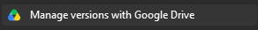
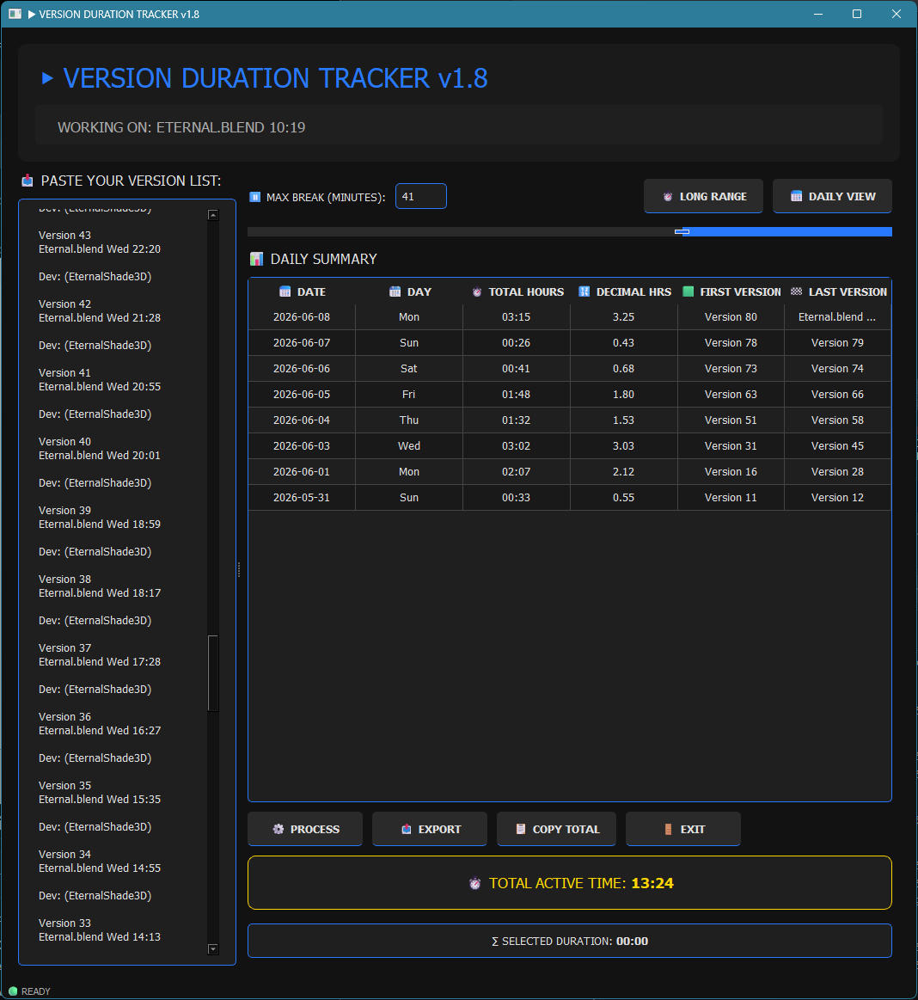
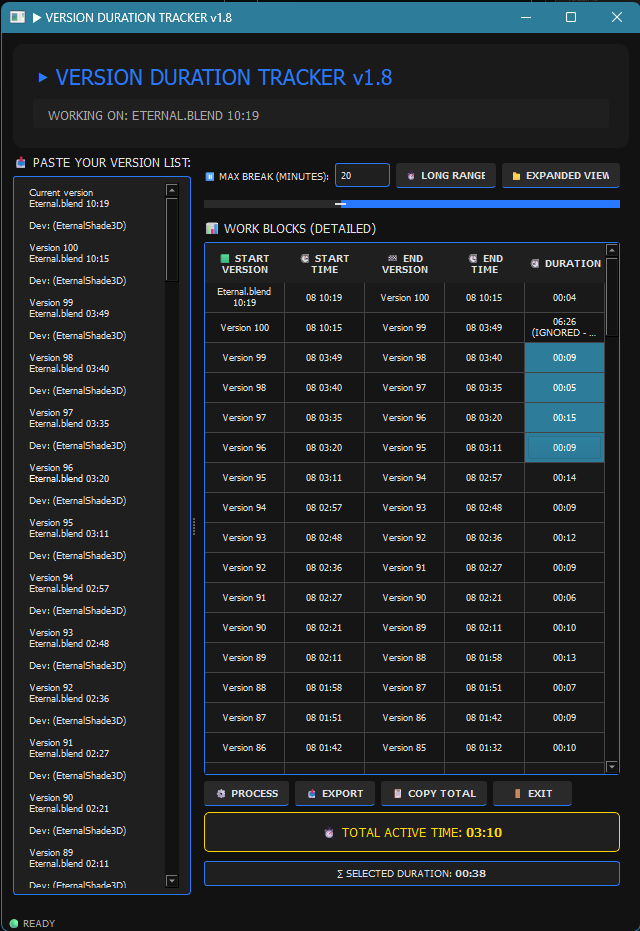
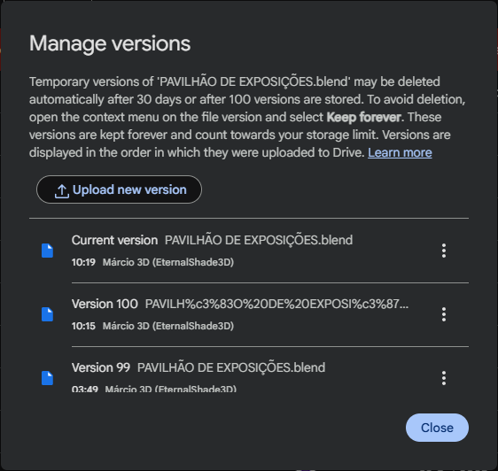

# Version Duration Tracker

Calculates **active work time** from Google Drive version saves. Paste a version list copied from Google Drive's "Manage versions" dialog (right‑click any file → Manage versions), set a break threshold, and get per‑day work hours with midnight‑split accuracy.

Works for **any file type** edited directly from Google Drive Desktop (maps a drive in Windows Explorer). Every time the file is saved, Google Drive adds a new version (max 100 — older ones are dropped). The tool calculates active duration by measuring intervals between consecutive saves and filtering out pauses longer than your set threshold.




## Features

- **Daily summary** — per‑day total hours, first/last version, decimal hours for spreadsheet paste
- **Work blocks** — consolidated sessions filtered by a configurable max‑break gap
- **Expanded view** — every version transition with individual durations
- **Midnight split** — intervals crossing midnight are attributed to the correct day
- **Max‑break slider** — 1–1440 min threshold; gaps larger than this are excluded as breaks
- **Export** — CSV or fixed‑width TXT of the current view
- **Clipboard** — copy individual cells or totals, Ctrl+C copies only the selected cell content
- **Dark theme** — full QSS dark UI, persistent window geometry via QSettings
- **Keyboard shortcuts**: `Ctrl+P` process, `Ctrl+E` export, `Ctrl+T` toggle view, `Ctrl+Shift+C` copy total, `Ctrl+Q` quit

<table>
  <tr>
    <td align="center"><b>Daily summary</b></td>
    <td align="center"><b>Work blocks / expanded view</b></td>
  </tr>
  <tr>
    <td></td>
    <td></td>
  </tr>
</table>

## Requirements

- Python 3.10+
- PySide6

```bash
pip install PySide6
```

## Quick Start

```bash
python VERSIONS_DURATION_TRACKER_v1.8.py
```

1. Paste a version list into the input area
2. Click **Process** or press `Ctrl+P`
3. Adjust the **max‑break slider** to filter pauses — start with **60** minutes
4. View daily totals, toggle to work blocks, or export

### Version List Format

The app parses version logs copied from Google Drive's web "Manage versions" page (select all text from top to bottom and paste):



```
Current version
my_project.blend
10:19
My Name

Version 100
my_project.blend
10:15
My Name

Version 1
my_project.blend
30 May, 18:00
My Name
```

Supports:
- `1 Jun, 23:58` — explicit dates
- `Sun 14:56` — day‑of‑week + time
- `10:19` — bare time (inferred from adjacent versions)
- `Current version` entries
- URL‑encoded filenames (`PAVILH%c3%83O%20DE%20EXPOSI%c3%87%c3%95ES.blend`)
- Blank‑line separated version blocks

## Project History

The full evolution from v0.1 (Jun 2025) to v1.8 is in [`CHANGELOG.md`](CHANGELOG.md) and [`history/`](history/).

| Version | Highlights |
|---------|-----------|
| **v1.8** | Decimal hours column, cell‑only clipboard copy |
| **v1.7** | Bug fixes (result_label crash, explicit date parsing) |
| **v1.6** | Daily summary view, midnight split |
| **v1.5** | Dark theme, max‑break slider, compact/expanded views, export |
| v0.1–v1.4 | Incremental development |

## License

MIT
